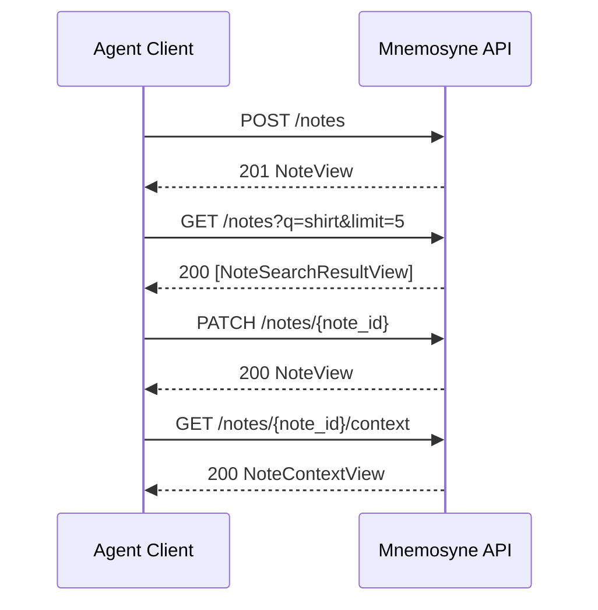

# Mnemosyne Alpha API Contract

This document defines the public API contract for `0.1.0-alpha`.

It is intentionally narrower than the eventual platform. The alpha is a
note-first memory API for agents. It does not expose revision edges, graph
internals, or conversational session state.

See also: [Alpha error model](./alpha-error-model.md)

## Contract Rules

- The API is stateless with respect to chat/session context.
- Clients own note targeting and short-lived conversational context.
- The API exposes stable `note_id` and integer `version`, not revision graph
  mechanics.
- `PATCH` derives a new version from the latest note state and merges
  `add_about` deterministically.
- Search operates on the latest visible note state only.
- Context responses are note-centric JSON, not graph-shaped storage leaks.
- Alpha uses `PATCH` as the only update operation. Full-replacement `PUT`
  semantics are deferred.

## Operational Surface

- Base path: endpoints are mounted at the service root, for example
  `http://127.0.0.1:8180`.
- Request bodies must use `Content-Type: application/json`.
- Alpha note endpoints do not require application-level client authentication.
  Deployment-level network or proxy auth is outside this API contract.
- `GET /healthz` returns service readiness:

```json
{
  "ok": true,
  "storage_initialized": true
}
```

If storage is not initialized, `GET /healthz` returns `503` with `ok: false`
and `storage_initialized: false`.

## Endpoint Flow



## Shared Shapes

Alpha clients should treat the schemas below as the source of truth for request
formatting. The examples that follow are illustrative instances of these
schemas.

Schema conventions:
- date-time strings must include a time component, such as
  `2026-04-06T17:00:00Z`; date-only values are rejected
- request date-time strings must include timezone information, either `Z` or an
  explicit offset such as `+02:00`
- response datetimes are serialized in UTC with a trailing `Z`
- `kind` must be one of `person`, `location`, `item`, `topic`, or `other`
- resolved `about` entries use `ref`
- pending `about` entries use `label`
- clients should not send fields that are not listed in these schemas

### CreateNoteRequest

```json
{
  "type": "object",
  "required": ["content"],
  "additionalProperties": false,
  "properties": {
    "content": {
      "type": "string",
      "minLength": 1,
      "description": "The full note text to store."
    },
    "about": {
      "type": "array",
      "items": { "$ref": "#/$defs/AboutInput" },
      "default": []
    },
    "observed_at": {
      "type": "string",
      "format": "date-time",
      "description": "When the fact was observed. Must include time and timezone."
    },
    "source_channel": {
      "type": "string",
      "minLength": 1,
      "description": "Optional provenance channel, for example chat, email, cli."
    }
  },
  "$defs": {
    "AboutInput": {
      "oneOf": [
        { "$ref": "#/$defs/ResolvedAboutInput" },
        { "$ref": "#/$defs/PendingAboutInput" }
      ]
    },
    "ResolvedAboutInput": {
      "type": "object",
      "required": ["kind", "ref"],
      "additionalProperties": false,
      "properties": {
        "kind": { "$ref": "#/$defs/AboutKind" },
        "ref": {
          "type": "object",
          "required": ["collection", "key"],
          "additionalProperties": false,
          "properties": {
            "collection": { "type": "string", "minLength": 1 },
            "key": { "type": "string", "minLength": 1 }
          }
        }
      }
    },
    "PendingAboutInput": {
      "type": "object",
      "required": ["kind", "label"],
      "additionalProperties": false,
      "properties": {
        "kind": { "$ref": "#/$defs/AboutKind" },
        "label": { "type": "string", "minLength": 1 }
      }
    },
    "AboutKind": {
      "type": "string",
      "enum": ["person", "location", "item", "topic", "other"]
    }
  }
}
```

### PatchNoteRequest

```json
{
  "type": "object",
  "required": ["version"],
  "additionalProperties": false,
  "properties": {
    "version": {
      "type": "integer",
      "minimum": 1,
      "description": "Latest note version observed by the client."
    },
    "addendum": {
      "type": "string",
      "minLength": 1,
      "description": "Text appended to the existing note content."
    },
    "add_about": {
      "type": "array",
      "items": { "$ref": "#/$defs/AboutInput" },
      "default": []
    },
    "observed_at": {
      "type": "string",
      "format": "date-time",
      "description": "Replacement observed timestamp for the new version. Must include timezone."
    }
  },
  "anyOf": [
    {
      "required": ["addendum"],
      "properties": {
        "addendum": { "type": "string", "minLength": 1 }
      }
    },
    {
      "required": ["add_about"],
      "properties": {
        "add_about": {
          "type": "array",
          "minItems": 1,
          "items": { "$ref": "#/$defs/AboutInput" }
        }
      }
    },
    { "required": ["observed_at"] }
  ],
  "$defs": {
    "AboutInput": {
      "oneOf": [
        { "$ref": "#/$defs/ResolvedAboutInput" },
        { "$ref": "#/$defs/PendingAboutInput" }
      ]
    },
    "ResolvedAboutInput": {
      "type": "object",
      "required": ["kind", "ref"],
      "additionalProperties": false,
      "properties": {
        "kind": { "$ref": "#/$defs/AboutKind" },
        "ref": {
          "type": "object",
          "required": ["collection", "key"],
          "additionalProperties": false,
          "properties": {
            "collection": { "type": "string", "minLength": 1 },
            "key": { "type": "string", "minLength": 1 }
          }
        }
      }
    },
    "PendingAboutInput": {
      "type": "object",
      "required": ["kind", "label"],
      "additionalProperties": false,
      "properties": {
        "kind": { "$ref": "#/$defs/AboutKind" },
        "label": { "type": "string", "minLength": 1 }
      }
    },
    "AboutKind": {
      "type": "string",
      "enum": ["person", "location", "item", "topic", "other"]
    }
  }
}
```

### Query Parameters

`GET /notes` accepts:

```json
{
  "type": "object",
  "required": ["q"],
  "additionalProperties": false,
  "properties": {
    "q": {
      "type": "string",
      "minLength": 1,
      "description": "Search text. Whitespace-only values are rejected."
    },
    "limit": {
      "type": "integer",
      "minimum": 1,
      "maximum": 50,
      "default": 5
    }
  }
}
```

### Resolved About Input

```json
{
  "kind": "item",
  "ref": {
    "collection": "item",
    "key": "item_shirt_001"
  }
}
```

### Unresolved About Input

```json
{
  "kind": "location",
  "label": "John's place"
}
```

### NoteView

Schema:

```json
{
  "type": "object",
  "required": [
    "note_id",
    "version",
    "content",
    "observed_at",
    "created_at",
    "resolved_about",
    "pending_about"
  ],
  "additionalProperties": false,
  "properties": {
    "note_id": { "type": "string", "pattern": "^note_[0-9]+$" },
    "version": { "type": "integer", "minimum": 1 },
    "content": { "type": "string" },
    "observed_at": { "type": "string", "format": "date-time" },
    "created_at": { "type": "string", "format": "date-time" },
    "resolved_about": {
      "type": "array",
      "items": { "$ref": "#/$defs/ResolvedAboutView" }
    },
    "pending_about": {
      "type": "array",
      "items": { "$ref": "#/$defs/PendingAboutView" }
    }
  },
  "$defs": {
    "ResolvedAboutView": {
      "type": "object",
      "required": ["kind", "collection", "key"],
      "additionalProperties": false,
      "properties": {
        "kind": { "$ref": "#/$defs/AboutKind" },
        "collection": { "type": "string" },
        "key": { "type": "string" }
      }
    },
    "PendingAboutView": {
      "type": "object",
      "required": ["kind", "label"],
      "additionalProperties": false,
      "properties": {
        "kind": { "$ref": "#/$defs/AboutKind" },
        "label": { "type": "string" }
      }
    },
    "AboutKind": {
      "type": "string",
      "enum": ["person", "location", "item", "topic", "other"]
    }
  }
}
```

Example:

```json
{
  "note_id": "note_001",
  "version": 2,
  "content": "Need to pick up my shirt.\n\nAddendum:\nIt is the blue one.",
  "observed_at": "2026-04-06T17:00:00Z",
  "created_at": "2026-04-06T17:00:00Z",
  "resolved_about": [
    {
      "kind": "item",
      "collection": "item",
      "key": "item_shirt_001"
    }
  ],
  "pending_about": [
    {
      "kind": "location",
      "label": "John's place"
    }
  ]
}
```

### NoteSearchResultView

`score` is an endpoint-local ranking hint. Scores from `GET /notes` and
`GET /notes/{note_id}/context` are not comparable across endpoints.

- Search scores currently represent text-match strength for the query.
- Context scores currently represent `about` overlap count with the anchor note.
- Clients should sort only within one response and should not persist score as a
  stable semantic value.

Schema:

```json
{
  "type": "object",
  "required": ["note_id", "version", "content_preview", "observed_at", "score"],
  "additionalProperties": false,
  "properties": {
    "note_id": { "type": "string", "pattern": "^note_[0-9]+$" },
    "version": { "type": "integer", "minimum": 1 },
    "content_preview": { "type": "string" },
    "observed_at": { "type": "string", "format": "date-time" },
    "score": { "type": "number" }
  }
}
```

Example:

```json
{
  "note_id": "note_001",
  "version": 2,
  "content_preview": "Need to pick up my shirt.",
  "observed_at": "2026-04-06T17:00:00Z",
  "score": 0.8123
}
```

### ErrorResponse

Schema:

```json
{
  "type": "object",
  "required": ["error", "details", "request_id"],
  "additionalProperties": false,
  "properties": {
    "error": {
      "type": "string",
      "enum": [
        "invalid_note_request",
        "invalid_note_patch",
        "note_not_found",
        "version_conflict"
      ]
    },
    "details": {
      "type": "array",
      "minItems": 1,
      "items": {
        "type": "object",
        "required": ["message", "code"],
        "additionalProperties": false,
        "properties": {
          "field": { "type": "string" },
          "message": { "type": "string" },
          "code": { "type": "string" },
          "context": { "type": "object" }
        }
      }
    },
    "request_id": {
      "type": ["string", "null"],
      "default": null
    }
  }
}
```

Known error contexts:

- `version_conflict`: `{"note_id": string, "current_version": integer, "requested_version": integer}`
- `note_not_found`: `{"note_id": string}`
- `invalid_note_request` and `invalid_note_patch`: no context in alpha

Version conflict example:

```json
{
  "error": "version_conflict",
  "details": [
    {
      "field": "version",
      "message": "Version does not match latest note version.",
      "code": "version_conflict",
      "context": {
        "note_id": "note_001",
        "current_version": 2,
        "requested_version": 1
      }
    }
  ],
  "request_id": null
}
```

Not found example:

```json
{
  "error": "note_not_found",
  "details": [
    {
      "field": "note_id",
      "message": "Note was not found.",
      "code": "note_not_found",
      "context": {
        "note_id": "note_999"
      }
    }
  ],
  "request_id": null
}
```

### NoteContextView

This endpoint is implemented for alpha and returns the latest note plus a small
set of related latest-note summaries.

Schema:

```json
{
  "type": "object",
  "required": ["note", "basis", "related_notes"],
  "additionalProperties": false,
  "properties": {
    "note": { "$ref": "#/$defs/NoteView" },
    "basis": {
      "type": "object",
      "required": ["resolved_about", "pending_about"],
      "additionalProperties": false,
      "properties": {
        "resolved_about": {
          "type": "array",
          "items": { "$ref": "#/$defs/ResolvedAboutView" }
        },
        "pending_about": {
          "type": "array",
          "items": { "$ref": "#/$defs/PendingAboutView" }
        }
      }
    },
    "related_notes": {
      "type": "array",
      "items": { "$ref": "#/$defs/NoteSearchResultView" }
    }
  },
  "$defs": {
    "NoteView": {
      "type": "object",
      "required": [
        "note_id",
        "version",
        "content",
        "observed_at",
        "created_at",
        "resolved_about",
        "pending_about"
      ],
      "additionalProperties": false,
      "properties": {
        "note_id": { "type": "string", "pattern": "^note_[0-9]+$" },
        "version": { "type": "integer", "minimum": 1 },
        "content": { "type": "string" },
        "observed_at": { "type": "string", "format": "date-time" },
        "created_at": { "type": "string", "format": "date-time" },
        "resolved_about": {
          "type": "array",
          "items": { "$ref": "#/$defs/ResolvedAboutView" }
        },
        "pending_about": {
          "type": "array",
          "items": { "$ref": "#/$defs/PendingAboutView" }
        }
      }
    },
    "NoteSearchResultView": {
      "type": "object",
      "required": [
        "note_id",
        "version",
        "content_preview",
        "observed_at",
        "score"
      ],
      "additionalProperties": false,
      "properties": {
        "note_id": { "type": "string", "pattern": "^note_[0-9]+$" },
        "version": { "type": "integer", "minimum": 1 },
        "content_preview": { "type": "string" },
        "observed_at": { "type": "string", "format": "date-time" },
        "score": { "type": "number" }
      }
    },
    "ResolvedAboutView": {
      "type": "object",
      "required": ["kind", "collection", "key"],
      "additionalProperties": false,
      "properties": {
        "kind": { "$ref": "#/$defs/AboutKind" },
        "collection": { "type": "string" },
        "key": { "type": "string" }
      }
    },
    "PendingAboutView": {
      "type": "object",
      "required": ["kind", "label"],
      "additionalProperties": false,
      "properties": {
        "kind": { "$ref": "#/$defs/AboutKind" },
        "label": { "type": "string" }
      }
    },
    "AboutKind": {
      "type": "string",
      "enum": ["person", "location", "item", "topic", "other"]
    }
  }
}
```

Example:

```json
{
  "note": {
    "note_id": "note_001",
    "version": 2,
    "content": "Need to pick up my shirt.\n\nAddendum:\nIt is the blue one.",
    "observed_at": "2026-04-06T17:00:00Z",
    "created_at": "2026-04-06T17:00:00Z",
    "resolved_about": [
      {
        "kind": "item",
        "collection": "item",
        "key": "item_shirt_001"
      }
    ],
    "pending_about": [
      {
        "kind": "location",
        "label": "John's place"
      }
    ]
  },
  "basis": {
    "resolved_about": [
      {
        "kind": "item",
        "collection": "item",
        "key": "item_shirt_001"
      }
    ],
    "pending_about": [
      {
        "kind": "location",
        "label": "John's place"
      }
    ]
  },
  "related_notes": [
    {
      "note_id": "note_014",
      "version": 1,
      "content_preview": "Blue PME Oxford shirt is at John's place.",
      "observed_at": "2026-04-05T09:30:00Z",
      "score": 0.7311
    }
  ]
}
```

## Endpoints

### `POST /notes`

Creates a new note and first version.

Request body: `CreateNoteRequest`

```json
{
  "content": "Need to pick up my shirt.",
  "about": [
    {
      "kind": "item",
      "ref": {
        "collection": "item",
        "key": "item_shirt_001"
      }
    },
    {
      "kind": "location",
      "label": "John's place"
    }
  ],
  "observed_at": "2026-04-06T17:00:00Z",
  "source_channel": "chat"
}
```

Response:
- `201 Created`
- body: `NoteView`
- `400 Bad Request`
- body: `ErrorResponse`

Rules:
- creates `version = 1`
- accepts both resolved and unresolved `about` entries
- if `observed_at` is omitted, the server uses request processing time
- `created_at` is set to the first revision's `observed_at` value; if the
  client supplies `observed_at`, `created_at` equals that supplied value
- does not require the client to manage revision history

### `GET /notes`

Searches current note state.

Query parameters: `GET /notes` query schema
- `q`: non-empty search string
- `limit`: integer `1..50`, default `5`

Response:
- `200 OK`
- body: `list[NoteSearchResultView]`
- `400 Bad Request`
- body: `ErrorResponse`

Rules:
- searches latest note state only
- does not search historical revisions directly
- does not interpret conversational pronouns or session state
- returns ranked candidates for client-side note selection

### `GET /notes/{note_id}`

Returns the latest visible view of a note.

Response:
- `200 OK`
- body: `NoteView`
- `404 Not Found`
- body: `ErrorResponse`

### `PATCH /notes/{note_id}`

Creates a derived new note version from the latest visible note.

Request body: `PatchNoteRequest`

```json
{
  "addendum": "It is the blue one.",
  "add_about": [
    {
      "kind": "location",
      "label": "John's place"
    }
  ],
  "observed_at": "2026-04-06T18:05:00Z",
  "version": 1
}
```

Response:
- `200 OK`
- body: `NoteView`
- `400 Bad Request`
- body: `ErrorResponse`
- `404 Not Found`
- body: `ErrorResponse`
- `409 Conflict`
- body: `ErrorResponse`

Rules:
- derives from the latest visible note
- appends structured addendum content rather than replacing content wholesale
- `addendum`, when provided, must be a non-empty string
- merges `add_about` into the new version with deterministic dedupe
- `add_about: []` by itself is not a patch operation
- if `observed_at` is omitted, the latest revision value is retained
- if `observed_at` is provided, it replaces the latest revision value in the
  new revision
- fails if no patch operation was requested

### `GET /notes/{note_id}/context`

Returns the latest note together with its immediate alpha context bundle.

Response:
- `200 OK`
- body: `NoteContextView`
- `404 Not Found`
- body: `ErrorResponse`

Rules:
- note-centric response, not raw graph/path output
- related notes are returned as ranked latest-note summaries
- context basis is explicit: resolved and pending about values used for context
- related notes are selected by:
  - shared resolved `about` refs, and
  - normalized pending labels matched case-insensitively
- the anchor note itself is excluded
- ranking is overlap count first, recency second
- alpha should cap related notes to a small list such as `5`

## Version And Error Semantics

- `version` is the client-facing optimistic concurrency field.
- Stale `version` values return `409 Conflict`.
- Missing notes return `404 Not Found`.
- Semantically invalid create and search requests return `400 Bad Request`.
- Semantically invalid patch requests return `400 Bad Request`.
- Error payloads use the shared `ErrorResponse` shape across note endpoints.
- For `PATCH`, target note existence is checked before version matching because
  missing notes have no latest version.
- Schema-version signaling is deferred for alpha and documented separately.

## Explicit Non-Goals For Alpha

- exposing revision edges directly in the public API
- exposing raw SurrealDB records or relation table names
- conversational/session-state interpretation inside the API runtime
- first-class entity/relationship/event/reminder write APIs
- full-replacement `PUT /notes/{note_id}` semantics
