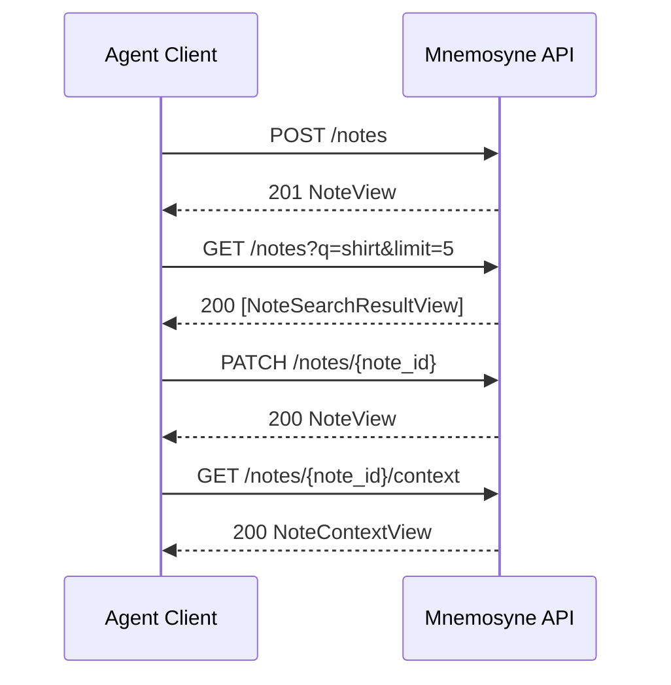

# Mnemosyne Alpha API Contract

This document defines the public API contract for `0.1.0-alpha`.

It is intentionally narrower than the eventual platform. The alpha is a
note-first memory API for agents. It does not expose revision edges, graph
internals, or conversational session state.

See also: [Alpha error model](./alpha-error-model.md)

## Contract Rules

- The API is stateless with respect to chat/session context.
- Clients own note targeting and short-lived conversational context.
- The API exposes stable `note_id` and integer `version`, not revision graph
  mechanics.
- `PUT` creates a fully specified new version and does not inherit prior note
  content or context.
- `PATCH` derives a new version from the latest note state and merges
  `add_about` deterministically.
- Search operates on the latest visible note state only.
- Context responses are note-centric JSON, not graph-shaped storage leaks.

## Endpoint Flow



## Shared Shapes

### Resolved About Input

```json
{
  "kind": "item",
  "ref": {
    "collection": "item",
    "key": "item_shirt_001"
  }
}
```

### Unresolved About Input

```json
{
  "kind": "place",
  "label": "John's place"
}
```

### NoteView

```json
{
  "note_id": "note_001",
  "version": 2,
  "content": "Need to pick up my shirt.\n\nAddendum:\nIt is the blue one.",
  "observed_at": "2026-04-06T17:00:00Z",
  "created_at": "2026-04-06T17:00:00Z",
  "resolved_about": [
    {
      "kind": "item",
      "collection": "item",
      "key": "item_shirt_001"
    }
  ],
  "pending_about": [
    {
      "kind": "place",
      "label": "John's place"
    }
  ]
}
```

### NoteSearchResultView

```json
{
  "note_id": "note_001",
  "version": 2,
  "content_preview": "Need to pick up my shirt.",
  "observed_at": "2026-04-06T17:00:00Z",
  "score": 0.8123
}
```

### ErrorResponse

```json
{
  "error": "version_conflict",
  "details": [
    {
      "field": "version",
      "message": "Version does not match latest note version.",
      "code": "version_conflict",
      "context": {
        "note_id": "note_001",
        "current_version": 2,
        "requested_version": 1
      }
    }
  ],
  "request_id": null
}
```

### NoteContextView

This is the alpha context response contract. It is defined here so retrieval
work has a concrete target, even if implementation lands later.

```json
{
  "note": {
    "note_id": "note_001",
    "version": 2,
    "content": "Need to pick up my shirt.\n\nAddendum:\nIt is the blue one.",
    "observed_at": "2026-04-06T17:00:00Z",
    "created_at": "2026-04-06T17:00:00Z",
    "resolved_about": [
      {
        "kind": "item",
        "collection": "item",
        "key": "item_shirt_001"
      }
    ],
    "pending_about": [
      {
        "kind": "place",
        "label": "John's place"
      }
    ]
  },
  "basis": {
    "resolved_about": [
      {
        "kind": "item",
        "collection": "item",
        "key": "item_shirt_001"
      }
    ],
    "pending_about": [
      {
        "kind": "place",
        "label": "John's place"
      }
    ]
  },
  "related_notes": [
    {
      "note_id": "note_014",
      "version": 1,
      "content_preview": "Blue PME Oxford shirt is at John's place.",
      "observed_at": "2026-04-05T09:30:00Z",
      "score": 0.7311
    }
  ]
}
```

## Endpoints

### `POST /notes`

Creates a new note and first version.

Request body:

```json
{
  "content": "Need to pick up my shirt.",
  "about": [
    {
      "kind": "item",
      "ref": {
        "collection": "item",
        "key": "item_shirt_001"
      }
    },
    {
      "kind": "place",
      "label": "John's place"
    }
  ],
  "observed_at": "2026-04-06T17:00:00Z",
  "source_channel": "chat"
}
```

Response:
- `201 Created`
- body: `NoteView`

Rules:
- creates `version = 1`
- accepts both resolved and unresolved `about` entries
- does not require the client to manage revision history

### `GET /notes`

Searches current note state.

Query parameters:
- `q`: non-empty search string
- `limit`: integer `1..50`, default `5`

Response:
- `200 OK`
- body: `list[NoteSearchResultView]`

Rules:
- searches latest note state only
- does not search historical revisions directly
- does not interpret conversational pronouns or session state
- returns ranked candidates for client-side note selection

### `GET /notes/{note_id}`

Returns the latest visible view of a note.

Response:
- `200 OK`
- body: `NoteView`
- `404 Not Found`
- body: `ErrorResponse`

### `PUT /notes/{note_id}`

Creates a fully specified new note version.

Request body:

```json
{
  "content": "Need to pick up my blue shirt on Saturday.",
  "about": [
    {
      "kind": "item",
      "ref": {
        "collection": "item",
        "key": "item_shirt_001"
      }
    }
  ],
  "observed_at": "2026-04-06T18:00:00Z",
  "version": 1
}
```

Response:
- `200 OK`
- body: `NoteView`
- `404 Not Found`
- body: `ErrorResponse`
- `409 Conflict`
- body: `ErrorResponse`

Rules:
- creates a new version of the same logical note
- requires the expected latest `version` for optimistic concurrency
- does not inherit prior content or prior `about` context implicitly

### `PATCH /notes/{note_id}`

Creates a derived new note version from the latest visible note.

Request body:

```json
{
  "addendum": "It is the blue one.",
  "add_about": [
    {
      "kind": "place",
      "label": "John's place"
    }
  ],
  "observed_at": "2026-04-06T18:05:00Z",
  "version": 1
}
```

Response:
- `200 OK`
- body: `NoteView`
- `400 Bad Request`
- body: `ErrorResponse`
- `404 Not Found`
- body: `ErrorResponse`
- `409 Conflict`
- body: `ErrorResponse`

Rules:
- derives from the latest visible note
- appends structured addendum content rather than replacing content wholesale
- merges `add_about` into the new version with deterministic dedupe
- fails if no patch operation was requested

### `GET /notes/{note_id}/context`

Returns the latest note together with its immediate alpha context bundle.

Response:
- `200 OK`
- body: `NoteContextView`
- `404 Not Found`
- body: `ErrorResponse`

Rules:
- note-centric response, not raw graph/path output
- related notes are returned as ranked latest-note summaries
- context basis is explicit: resolved and pending about values used for context
- this contract is defined now for alpha retrieval work, even if implementation
  lands later than the write/search endpoints

## Version And Error Semantics

- responses should expose `X-Mnemosyne-Schema-Version: 0.1.0-alpha`
- `version` is the client-facing optimistic concurrency field.
- Stale `version` values return `409 Conflict`.
- Missing notes return `404 Not Found`.
- Semantically invalid patch requests return `400 Bad Request`.
- Error payloads use the shared `ErrorResponse` shape across note endpoints.

## Explicit Non-Goals For Alpha

- exposing revision edges directly in the public API
- exposing raw Arango documents or graph edge names
- conversational/session-state interpretation inside the API runtime
- first-class entity/relationship/event/reminder write APIs
