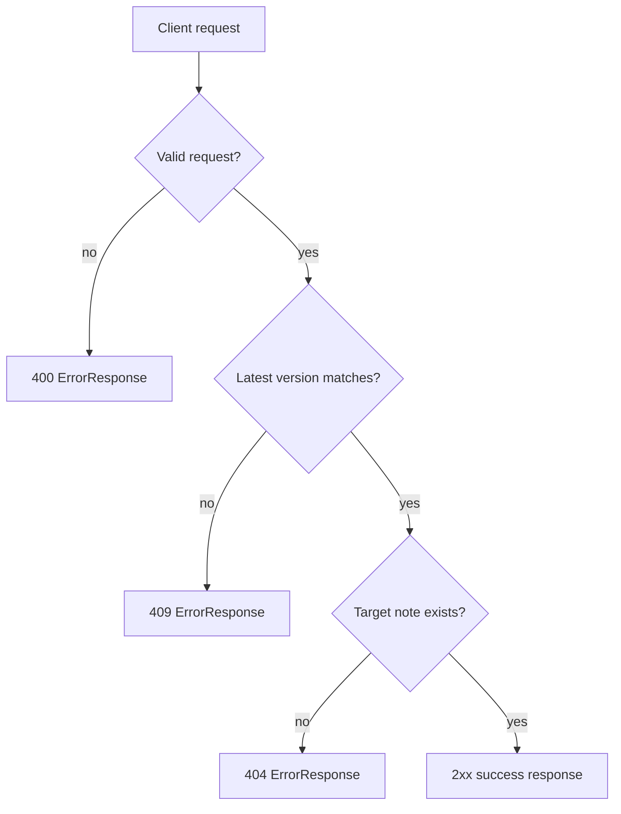

# Mnemosyne Alpha Error Model And Schema Versioning

This document defines the shared error payload for `0.1.0-alpha` and records
what is explicitly deferred.

See also: [Alpha API contract](./alpha-api-contract.md)

## Decision

For alpha, Mnemosyne uses:

- one shared JSON error shape across note endpoints
- a minimal set of stable public error names that do not leak DB or graph
  internals

That is enough for alpha. Anything more elaborate is ceremony.

## Shared Error Shape

All application-level error responses should converge on this payload:

```json
{
  "error": "version_conflict",
  "details": [
    {
      "field": "version",
      "message": "Version does not match latest note version.",
      "code": "version_conflict",
      "context": {
        "note_id": "note_001",
        "current_version": 2,
        "requested_version": 1
      }
    }
  ],
  "request_id": null
}
```

Top-level fields:

- `error`: stable high-level error identifier
- `details`: structured detail entries
- `request_id`: optional correlation id for logs and tracing

Detail fields:

- `field`: optional field or parameter reference
- `message`: human-readable explanation
- `code`: stable machine-readable detail code
- `context`: optional structured metadata

## Error Flow



## Current Alpha Errors

Alpha only needs the errors already implied by the current write/read surface:

- `invalid_note_patch`
- `note_not_found`
- `version_conflict`

Anything broader can wait until the API surface is larger.

## Public Naming Rules

- error names must describe API behavior, not storage internals
- do not expose collection names, edge names, AQL terms, or Arango-specific
  implementation details in `error` or `code`
- `note_not_found` is acceptable
- `latest_revision_edge_missing` is not

## Version Semantics

Do not conflate API contract version with note version.

- the public API contract is currently documented, not header-versioned
- `version` inside note payloads describes optimistic concurrency for one note

Those are different things and should stay different.

## Current Alpha Scope

For `0.1.0-alpha`, the required guarantees are:

- `400`, `404`, and `409` use the shared `ErrorResponse` shape
- note writes and reads use stable public error names
- public docs refer to public API terms, not DB internals

## Deferred

- schema-version signaling headers
- path or media-type versioning
- multi-schema negotiation
- endpoint-specific error envelopes
- graph/path-specific error formats
