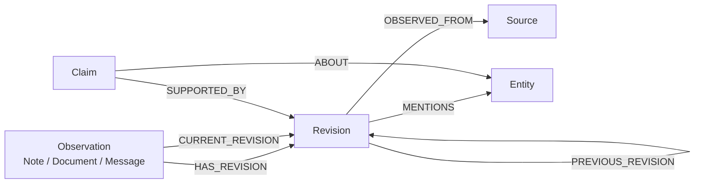

# Mnemosyne Alpha Model

Mnemosyne is a truth center for a user's life facts. The alpha implementation is
observation-centered.

See also: [ArcadeDB schema design](./arcadedb-schema-design.md)

## Core Model

## Alpha Scope

Implemented now:

- observations
- note observations
- immutable revisions
- sources
- entity mentions
- topic string mentions and recent topic lookup
- revision metadata for `domain`, `sensitivity`, `subject`, and
  `allowed_purposes`
- first-class entity registry records for people, locations, stores/vendors, and
  classified items, with scope and sensitivity metadata
- default-off access-context headers, domain policy checks, safe projections, and
  access audit events
- latest observation reads
- patch-based revision creation

Schema-ready, API deferred:

- claims
- claim support edges
- accepted/current truth projections
- payment-method entities and store-location/payment-method edges
- asynchronous extraction/consolidation jobs for candidate claims and events

Out of scope:

- old data import
- `/notes` compatibility
- full ontology for tasks, events, reminders, and relationships

## Semantics

- `Observation` is how information enters the system.
- `Revision` is immutable observed state.
- `Entity` represents people, locations, stores/vendors, items, topics, and
  unknown entities.
- `MENTIONS` links a revision to entities for evidence navigation.
- `Claim` is the candidate-truth object, but claim-writing endpoints are not in
  this alpha slice.
- Access and projection rules are feature-flagged and default off. When enabled,
  callers present purpose/scopes/projection headers and receive safe projections
  rather than an automatic raw dump of the shared graph.
