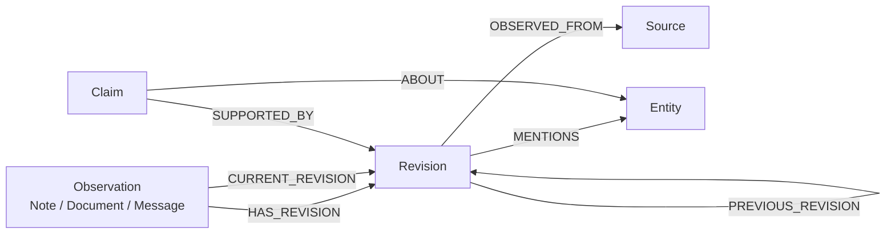

# Mnemosyne Alpha Model

Mnemosyne is a truth center for a user's life facts. The alpha implementation is
observation-centered.

See also: [ArcadeDB schema design](./arcadedb-schema-design.md)

## Core Model

## Alpha Scope

Implemented now:

- observations
- note observations
- immutable revisions
- sources
- entity mentions
- latest observation reads
- patch-based revision creation

Schema-ready, API deferred:

- claims
- claim support edges
- accepted/current truth projections

Out of scope:

- old data import
- `/notes` compatibility
- full ontology for tasks, events, reminders, and relationships

## Semantics

- `Observation` is how information enters the system.
- `Revision` is immutable observed state.
- `Entity` represents people, locations, items, topics, and unknown entities.
- `MENTIONS` links a revision to entities for evidence navigation.
- `Claim` is the candidate-truth object, but claim-writing endpoints are not in
  this alpha slice.
