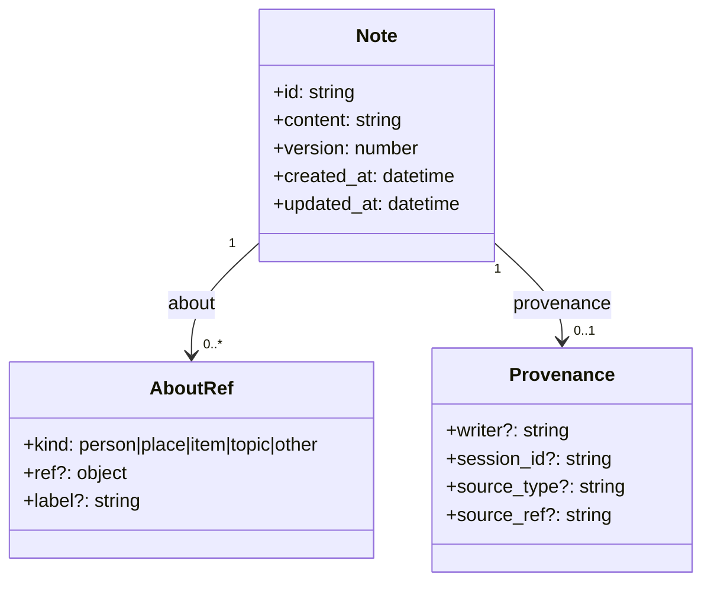
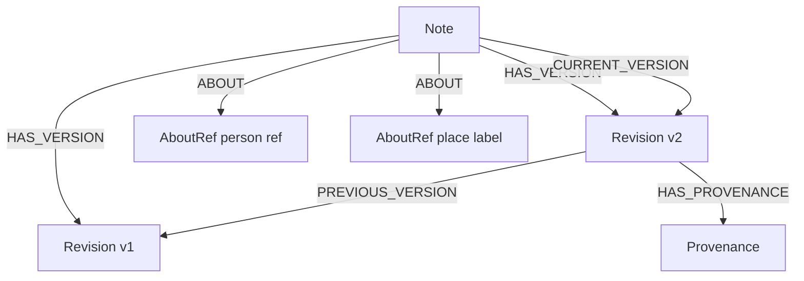

# Mnemosyne Alpha Model

This document captures the intended `0.1.0-alpha` data model at a level that is concrete enough to build against without pretending the richer post-alpha taxonomy already exists.

See also: [Alpha API contract](./alpha-api-contract.md)

## Public Alpha Model

For alpha, Mnemosyne is a note-first memory system for agents.

- `Note` is the only required first-class persisted record.
- `AboutRef` carries explicit references or unresolved labels attached to a note.
- `Provenance` carries optional metadata about who wrote a note and where it came from.
- Updates create new versions of the same logical note instead of inventing unrelated notes.

## Storage Graph Sketch

This is the internal graph shape we are aiming at for alpha. It is an implementation sketch, not a promise that graph internals leak into the public API.

## Minimum Alpha Semantics

- A new memory creates a new `Note` with version `1`.
- An update to an existing memory keeps the same `Note.id` and creates a new revision with version `n+1`.
- Previous revisions are retained.
- Normal reads return the latest note snapshot.
- Unresolved references stay unresolved as labels until a later explicit resolution step exists.

## Explicitly Out Of Scope For Alpha

- first-class `entity`, `relationship`, `event`, or `reminder` records
- automatic extraction or inference
- background enrichment pipelines
- pretending storage edges are the public product model
