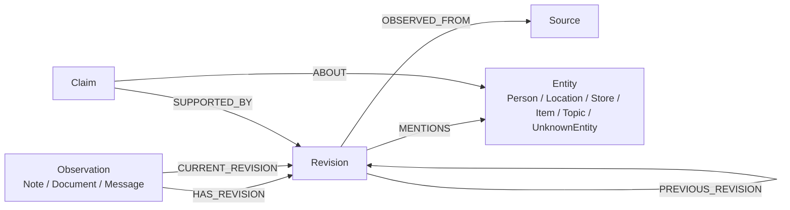

# ArcadeDB Schema Design

Status: draft design

Mnemosyne is a truth center for the user's life facts. Notes are not the center
of the model. Notes are one way agents add information, and other sources,
formats, and traversals must fit the same backbone.

## Goals

- Model user-life truth as evidence-backed knowledge, not as note storage.
- Keep the first implementation small enough to build.
- Use ArcadeDB graph types for relationship-bearing domain objects.
- Use document types only for relationship-free operational data.
- Preserve immutable revision history for incoming observations.
- Avoid SurrealDB schema translation and legacy data import.

## Non-Goals

- Importing old SurrealDB or old Mnemosyne records.
- Preserving old `collection` / `key` about-ref compatibility.
- Preserving the current `/notes` API contract.
- Designing the full ontology for events, tasks, reminders, or relationships.
- Making BI projections a design driver.
- Using ArcadeDB RIDs as domain identifiers.

## ArcadeDB Modeling Rules

Use ArcadeDB vertex and edge types for domain objects that participate in
relationships or traversal. Use document types for logs, time-series/event logs,
configuration records, request traces, import jobs, parser output, and payloads
that do not need graph relationships.

ArcadeDB records are documents, vertices, or edges. Vertices are document-like
records with graph behavior and can connect to other vertices through edges.
Types are the logical schema surface and buckets are physical storage.

References:

- [Records, documents, vertices, and edges](https://docs.arcadedb.com/arcadedb/concepts/basics)
- [SQL types](https://docs.arcadedb.com/arcadedb/reference/sql/sql-types)
- [CREATE EDGE](https://docs.arcadedb.com/arcadedb/reference/sql/sql-create-edge)
- [Materialized views](https://docs.arcadedb.com/arcadedb/how-to/data-modeling/materialized-views)

## Recommended Model

Green path: evidence-backed knowledge graph.



Core types:

- `Observation`: an incoming record from a user, agent, document, message, or
  integration.
- `Revision`: immutable observed state for an observation.
- `Source`: reusable provenance origin, such as an agent session, import source,
  app integration, or user channel.
- `Entity`: durable world object in the user's life. Shared real-world entities
  exist once in the graph and app/domain meaning is attached through scoped
  facts, claims, policies, and projections rather than duplicated app objects.
- `Claim`: one knowledge candidate that may be proposed, accepted, rejected, or
  superseded.

The earlier draft idea of `Revision -ABOUT-> Entity` is intentionally replaced
by `Revision -MENTIONS-> Entity`. `MENTIONS` is evidence extraction and
navigation. `ABOUT` is reserved for `Claim -ABOUT-> Entity`, because claims are
where knowledge semantics live.

## Option Set

Green: evidence-backed knowledge graph.

This is the recommended path. It keeps notes as observations while putting
truth in claims, entities, sources, and evidence links. What breaks in 6 months:
mostly ontology decisions, not the storage backbone.

Blue: direct relationship graph.

Add typed relationship edges early, for example `Person -LIVES_AT-> Location`.
This is strong when the relationship vocabulary is stable. What breaks in 6
months: relationship edge types can explode, and evidence/conflict handling on
edges becomes hard.

Amber: note-centered graph.

Keep `Note`, `Revision`, and `Entity` as the main model and add claims later.
This is easier to implement. What breaks in 6 months: notes become accidental
truth authority and later truth extraction becomes a second migration.

Red: generic fact blob.

Store facts as flexible JSON records. This is fast to write and weak everywhere
that matters. What breaks in 6 months: truth semantics move into app code and
query conventions.

## Vertex Types

### Observation

Base vertex for information that enters the system.

Properties:

- `id`: prefixed ULID-style ID, `obs_...`
- `created_at`
- `updated_at`
- `lifecycle_status`: `active`, `archived`, `deleted`

Subtypes:

- `Note`
- `DocumentObservation`
- `MessageObservation`

`Note` is the first implemented subtype. Future sources should add new
observation subtypes instead of changing the truth model.

`DocumentObservation` is a graph vertex for an ingested document that supports
claims or mentions entities. Raw payload, parser output, import logs, and
processing traces may still be document types when they do not participate in
relationships.

### Revision

Immutable version of an observation.

Properties:

- `id`: derived ID, for example `obs_...:v2`
- `observation`
- `version`
- `content`
- `content_format`: initially `text/plain`
- `domain`: broad source/meaning domain such as `general`, `health`, `finance`,
  `documents`, `identity`, `household`, `shopping`, or `system`
- `sensitivity`: `public`, `personal`, `confidential`, `restricted`, or `secret`
- `subject`: optional subject/person scope for policy decisions
- `allowed_purposes`: serialized list of allowed use purposes, such as `recall`,
  `accounting`, `reminder`, or `medication_management`
- `observed_at`
- `created_at`

Revisions are vertices, not embedded documents. They participate in provenance,
mentions, previous-version traversal, support links, comparison, rollback, and
future temporal reasoning.

### Entity

Base vertex for durable world objects.

Properties:

- `id`: prefixed ULID-style ID, `ent_...`
- `label`
- `normalized_label`
- `resolution_status`: `unresolved`, `resolved`, `merged`, `archived`
- `scope`: namespace/bounded-context scope. This prevents unrelated domains from
  accidentally coalescing same-label entities.
- `sensitivity`
- `allowed_purposes`
- `created_at`
- `updated_at`

Subtypes:

- `Person`
- `Location`
- `Store`
- `Item`
- `Topic`
- `PaymentMethod` (schema-ready support type)
- `UnknownEntity`

The public entity registry currently creates and lists `Person`, `Location`,
`Store`, and `Item` records. `Topic` remains primarily an observation mention
shortcut. `PaymentMethod` and store relationship edges are schema-ready for
commerce/receipt modeling but do not yet have a first-class API surface.

Typed unresolved inputs become unresolved vertices of their subtype. For
example, a `location` label-only input creates or reuses a `Location` with
`resolution_status = "unresolved"`. `UnknownEntity` is for truly unknown
categories and public `other` input.

`Topic.normalized_label` is indexed for topic-specific lookup. Agents may use
colon-separated topic labels such as `coding:fcrozetta:python:coding-style`;
read endpoints support partial topic label matching.

The entity registry is intentionally richer than mention creation. A mention is
evidence navigation; a first-class entity record is an identity/profile record
with scope, sensitivity, allowed-purpose metadata, and subtype-specific fields
such as person contact methods, physical addresses, vendor/store categories, or
classified item attributes.

### Claim

One knowledge candidate.

Properties:

- `id`: prefixed ULID-style ID, `clm_...`
- `statement`
- `status`: `proposed`, `accepted`, `rejected`, `superseded`
- `confidence`
- `valid_from`
- `valid_to`
- `created_at`
- `updated_at`

Do not use `Fact` as canonical storage. A fact is a projection of accepted,
current claims. The database stores claims because truth can be uncertain,
superseded, or contradicted.

### Source

Reusable provenance origin.

Properties:

- `id`: prefixed ULID-style ID, `src_...`
- `source_type`: `user`, `agent`, `import`, `integration`, `system`
- `label`
- `source_ref`
- `created_at`

Per-observation metadata belongs on the `OBSERVED_FROM` edge, not in a
provenance vertex per revision.

## Edge Types

### HAS_REVISION

From `Observation` to `Revision`.

Meaning: this immutable revision belongs to this observation.

### CURRENT_REVISION

From `Observation` to `Revision`.

Meaning: this is the revision used by normal reads.

Constraint: one current revision per observation.

### PREVIOUS_REVISION

From `Revision` to `Revision`.

Meaning: version chain from newer revision to previous revision.

### OBSERVED_FROM

From `Revision` to `Source`.

Meaning: this revision was observed from this source.

Edge properties:

- `writer`
- `session_id`
- `observed_channel`
- `created_at`

### MENTIONS

From `Revision` to `Entity`.

Meaning: the revision text or payload mentions this entity. This is extraction
and navigation, not truth.

Edge properties:

- `origin`: `user_supplied`, `agent_extracted`, `imported`
- `confidence`
- `created_at`

### ABOUT

From `Claim` to `Entity`.

Meaning: the claim is about this entity. Early claims can have multiple `ABOUT`
edges instead of over-modeling subject/object structure too soon.

### SUPPORTED_BY

From `Claim` to `Revision`.

Meaning: this revision is evidence for the claim.

Edge properties:

- `support_type`: `direct`, `inferred`, `contextual`
- `confidence`
- `created_at`

## Note Flow

Creating a note creates:

1. `Note` observation.
2. `Revision` version 1 with the note content.
3. `HAS_REVISION` and `CURRENT_REVISION`.
4. `Source` if no reusable source exists.
5. `OBSERVED_FROM` from revision to source.
6. `Entity` vertices for supplied or extracted mentions.
7. `MENTIONS` from revision to entities.
8. Optional `Claim` vertices when the agent asserts candidate truth.
9. `SUPPORTED_BY` from claims to the revision.
10. `ABOUT` from claims to entities.

Patching a note creates a new immutable `Revision`, moves `CURRENT_REVISION`,
adds `PREVIOUS_REVISION`, and recreates current `MENTIONS` based on the new
revision state. Old revisions keep their old mentions.

## API Mapping

The canonical public write surface should be `/observations`, not `/notes`.
Mnemosyne is still alpha, and compatibility is less important than exposing the
right abstraction.

Create a note observation:

```http
POST /observations
```

```json
{
  "type": "note",
  "content": "My blue shirt is at John's place.",
  "mentions": [
    { "type": "item", "label": "blue shirt" },
    { "type": "location", "label": "John's place" }
  ],
  "topics": ["personal:clothing:location"],
  "source": {
    "source_type": "agent",
    "label": "codex"
  }
}
```

Return:

```json
{
  "id": "obs_01...",
  "type": "note",
  "version": 1,
  "current_revision": "obs_01...:v1"
}
```

API rules:

- public identity is `id` on observation resources; `/notes`/`note_id` remain out of scope
- returned version maps to `Revision.version`; patch requests do not supply it
- content maps to `Revision.content`
- supplied mentions create `MENTIONS` edges, not truth claims
- supplied `topics` create `topic` mentions and can be read through
  `GET /topics/{topic}/observations?limit=5`, with partial topic label matching
- optional agent-derived claims create `Claim` vertices supported by the revision
- `/notes` is not part of the core design; it can be added later as a
  convenience alias only if real usage proves it useful

## Read Projections

`observations_latest` is a read projection, not source of truth.

It projects:

- `Observation`
- its `CURRENT_REVISION`
- current revision mentions
- source metadata needed by the API

Future projections may include:

- `notes_latest`: note-only convenience projection if usage justifies it
- `claims_current`: accepted current claims
- `entities_unresolved`: unresolved entities needing review
- `observations_by_source`: recent observations by source

## ID Rules

Use prefixed ULID-style domain IDs:

- `obs_...` for observations
- `ent_...` for entities
- `clm_...` for claims
- `src_...` for sources
- `obs_...:vN` for revisions

Do not expose or depend on ArcadeDB RID values in domain logic or public API
contracts.

## Storage Rebuild Plan

This is a rebuild, not a legacy data migration.

1. Add ArcadeDB compose/service configuration.
2. Add ArcadeDB schema bootstrap for the target vertex and edge types.
3. Implement an ArcadeDB storage backend and observation repository path.
4. Replace the public note API with `/observations` as the canonical write and
   read surface.
5. Replace old note-first model names in code with observation/revision/entity
   concepts where they affect storage.
6. Add tests for create note, patch note, latest note projection, source reuse,
   entity creation, mention edges, and claim support edges.
7. Delete SurrealDB bootstrap, repository, schema files, docs, and tests after
   the ArcadeDB path is verified.

## Testing Focus

- Schema bootstrap is idempotent.
- Domain IDs are generated and indexed independently from RIDs.
- A note create writes `Observation`, `Revision`, source edge, and mentions.
- A note patch creates a new immutable revision and keeps old revision state.
- `CURRENT_REVISION` has exactly one edge per observation.
- `MENTIONS` are revision-scoped.
- Claims can be supported by revisions without making notes the truth center.
- Read projection returns the expected observation view.
